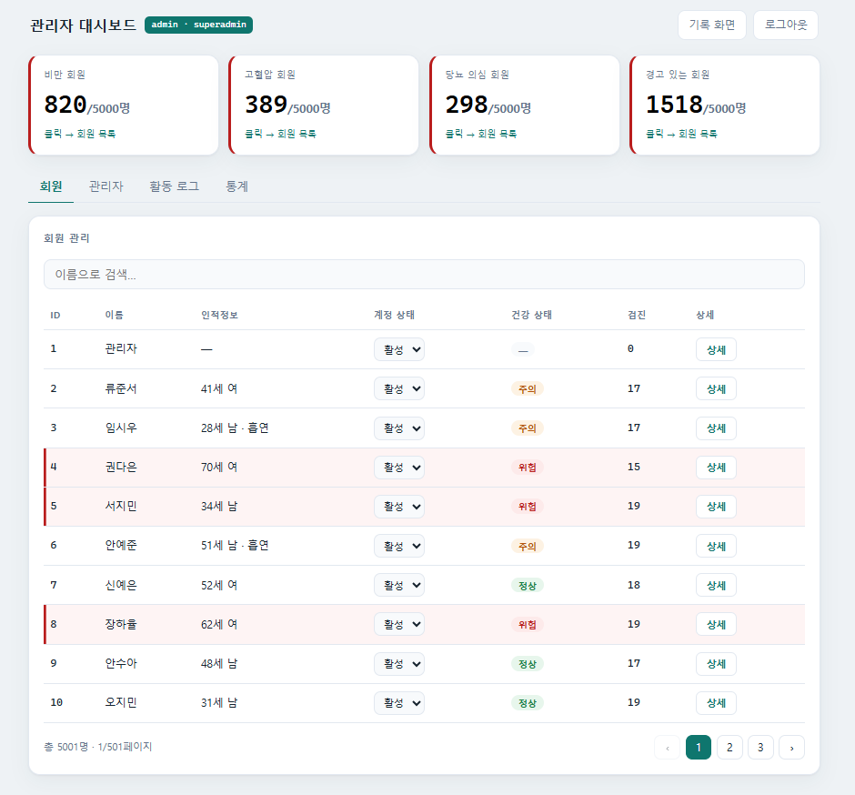
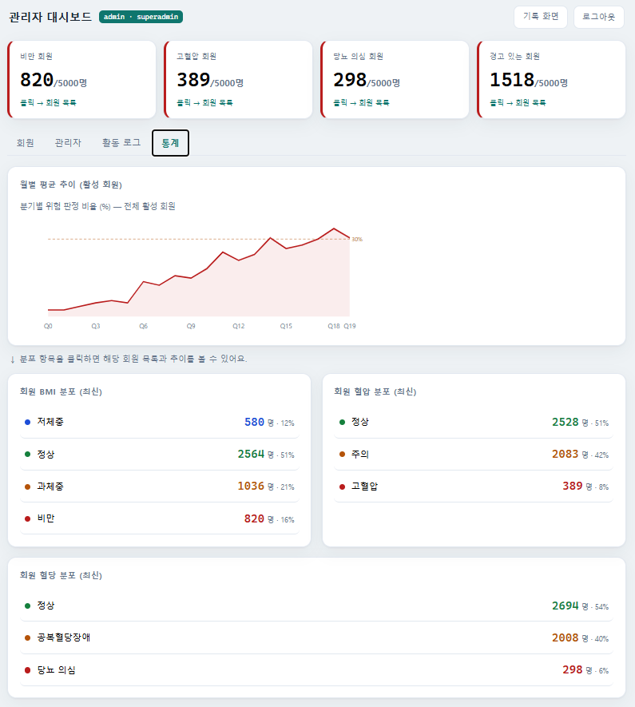
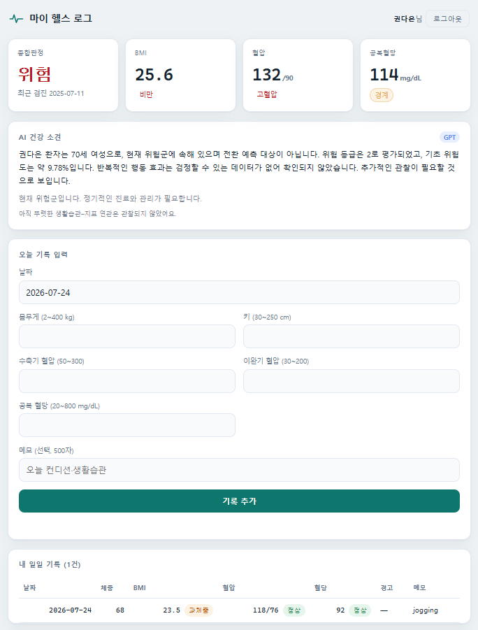
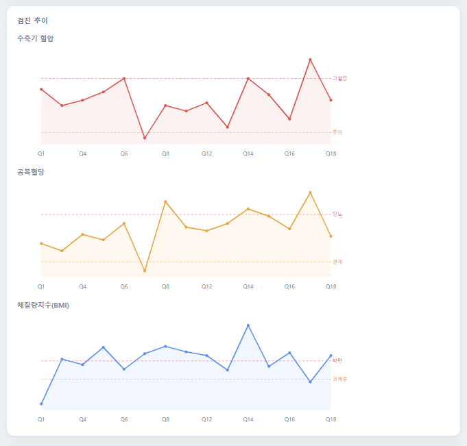

# 마이 헬스 로그 API

> 매일의 건강 수치를 기록하면 BMI를 자동 계산하고 혈압·혈당을 분류해 경고를 알려주는, 로그인 기반 개인 건강 관리 REST API + 병원용 관리 대시보드.

**🌐 배포 URL:** https://health-log.f30rczkmnnh6j.ap-northeast-2.cs.amazonlightsail.com/docs
(대시보드: [`/dashboard`](https://health-log.f30rczkmnnh6j.ap-northeast-2.cs.amazonlightsail.com/dashboard) · 사용자 화면: [`/ui`](https://health-log.f30rczkmnnh6j.ap-northeast-2.cs.amazonlightsail.com/ui))

회원가입·로그인 후 건강 수치(몸무게·키·혈압·혈당 등)를 저장하면 서버가 BMI 계산, 혈압/혈당 분류, 경고 생성을 자동으로 처리하고, 쌓인 기록으로 검색·통계·주간 리포트를 제공합니다. 데이터는 SQLite에 저장되며 기록은 로그인한 사용자별로 분리됩니다. 관리자는 별도 대시보드에서 회원 현황·위험군·활동 로그를 확인할 수 있습니다.

> ⚠️ 학습용 프로젝트입니다. 건강 분류 기준은 국내 공개 기준을 참고했으나 실제 의학적 진단이 아닙니다.

## 화면 캡쳐

| 관리자 대시보드 (회원 관리) | 통계 |
|---|---|
|  |  |

| 사용자 화면 + AI 소견 | 검진 추이 |
|---|---|
|  |  |

> 활동 로그·관리자 권한·검진 이력 등 전체 화면은 [프로젝트 보고서(PDF)](docs/프로젝트_보고서.pdf) 참고.

## 빠른 시작

```bash
python -m venv venv
venv\Scripts\activate          # Windows (macOS/Linux: source venv/bin/activate)
pip install -r requirements.txt

set SECRET_KEY=아무_긴_임의_문자열   # Windows (Linux/macOS: export SECRET_KEY=...)
uvicorn main:app --reload --port 8001
```

| 주소 | 용도 |
|------|------|
| http://127.0.0.1:8001/docs | Swagger UI (API 테스트) |
| http://127.0.0.1:8001/ui | 사용자 화면 |
| http://127.0.0.1:8001/dashboard | 관리자 대시보드 |

**첫 가입자가 자동으로 superadmin**이 됩니다. `/ui`에서 회원가입 후 `/dashboard`로 로그인하세요.

더미 데이터가 필요하면:

```bash
python seed.py
```

## Docker 실행

```bash
docker build -t health-log-api .
docker run -d -p 8002:8000 -e SECRET_KEY=아무_긴_임의_문자열 health-log-api
```

접속: http://127.0.0.1:8002/docs

> 컨테이너 안에서는 8000번, 호스트에서는 8002번으로 매핑합니다.
> 로컬 개발 서버(8001)와 포트가 겹치지 않게 일부러 다른 번호를 씁니다.
> 컨테이너는 빈 DB로 시작하므로 **첫 가입자가 superadmin**이 됩니다.

## 환경 변수

| 이름 | 기본값 | 설명 |
|------|--------|------|
| `SECRET_KEY` | 실행 시 임의 생성 | JWT 서명 키. **지정하지 않으면 서버를 재시작할 때마다 기존 토큰이 모두 무효**가 됩니다. |
| `TOKEN_EXPIRE_HOURS` | `12` | 토큰 유효 시간 |
| `OPENAI_API_KEY` | 없음 | 있으면 AI 소견을 GPT로 생성, 없으면 규칙 기반 템플릿. `.env` 파일에 넣어도 됩니다. |
| `OPENAI_MODEL` | `gpt-4o-mini` | 사용할 GPT 모델 |

> API 키는 `.env` 파일에 `OPENAI_API_KEY=sk-...` 형태로 저장하세요. `.env`는 `.gitignore`에 있어 커밋되지 않습니다.
> **키를 소스 코드나 저장소에 직접 넣지 마세요.**

## AI 위험 예측 & 인사이트

`/dashboard`에서 회원 상세를 열면 **AI 소견 카드**가 표시됩니다. 세 단계로 동작합니다.

1. **ML — 위험 전환 확률**: 학습된 로지스틱 모델([`train_model.py`](train_model.py))이 검진 시계열로
   "현재 정상·주의인 회원이 다음 분기에 위험군으로 전환될 확률"을 예측합니다. (모델 파일 [`models/risk_model.joblib`](models/))
2. **통계 — 행동 인사이트**: 생활습관 메모(운동·야식·음주 등)가 있던 검진과 없던 검진의 지표를
   **Welch 2표본 t-검정**으로 비교하고, 표본수·95% 신뢰구간·다중비교 보정(Benjamini–Hochberg) 후
   **유의한 효과만** 남깁니다. ([`stats.py`](stats.py))
3. **LLM — 소견 서술**: 위 숫자를 문장으로 옮깁니다. **판단은 하지 않고** 계산된 값만 서술하며,
   `OPENAI_API_KEY`가 없으면 동일한 규율의 규칙 템플릿을 씁니다. ([`llm.py`](llm.py))

> 검진 데이터는 코호트 생성기([`load_cohort.py`](load_cohort.py))로 DB에 적재합니다:
> `python load_cohort.py 5000` (5,000명 × 분기 검진). 이때 로그인 계정은 `admin` / `admin1234` (superadmin).

## 데이터 모델

ERD와 DB↔API 스키마 매핑은 [`docs/ERD.md`](docs/ERD.md), ErdCloud import용 DDL은 [`docs/schema.sql`](docs/schema.sql) 참고.

- **USER** 1 : N **RECORD** — 사용자 한 명이 여러 건강 기록을 가짐
- **USER** 1 : N **ACTIVITY_LOG** — 로그인·기록 변경·권한 변경 활동 로그

`users.status` 로 계정 상태를 관리합니다: `active`(정상) / `dormant`(휴면) / `withdrawn`(탈퇴).
**탈퇴는 행을 지우지 않는 소프트 삭제**이며, 탈퇴한 아이디로 재가입하면 기존 계정이 자동 복구됩니다.

## 엔드포인트

### 인증

| 메서드 | 경로 | 설명 |
|--------|------|------|
| POST | `/signup` | 회원가입 (bcrypt 해시 저장, 첫 가입자는 superadmin) |
| POST | `/login` | 로그인, JWT 토큰 발급 (OAuth2 password flow) |
| GET | `/me` | 내 정보 조회 |

### 건강 기록 — 로그인 필요, 본인 기록만

| 메서드 | 경로 | 설명 |
|--------|------|------|
| POST | `/records` | 기록 추가 (BMI·분류·경고 자동 계산) |
| GET | `/records` | 내 기록 전체 조회 |
| GET | `/records/{id}` | 기록 하나 조회 (없으면 404) |
| PUT | `/records/{id}` | 기록 수정 |
| DELETE | `/records/{id}` | 기록 삭제 |
| GET | `/search?start=&end=` | 날짜 범위 검색 |
| GET | `/stats` | 평균 체중·BMI 등 통계 |
| GET | `/report/weekly` | 최근 7일 vs 지난주 평균 체중 변화 |

### 관리자 — `admin` 이상

| 메서드 | 경로 | 권한 | 설명 |
|--------|------|------|------|
| GET | `/admin/users` | admin+ | 회원 목록 (검색·페이징·기록 수) |
| GET | `/admin/users/{id}` | admin+ | 회원 상세 (기간 필터, 월별 구분) |
| GET | `/admin/users/{id}/insights` | admin+ | 행동–지표 인사이트 (메모 기반) |
| GET | `/admin/logs` | admin+ | 활동 로그 (액션·기간 필터) |
| GET | `/admin/stats` | admin+ | 전체 회원·기록·로그 수 |
| GET | `/admin/health-stats` | admin+ | 위험군 집계 (비만·고혈압·당뇨·경고) |
| GET | `/admin/health-group` | admin+ | 위험군 드릴다운 (해당 회원 목록) |
| PUT | `/admin/users/{id}/status` | admin+ | 계정 상태 변경 (정상·휴면·탈퇴) |
| DELETE | `/admin/users/{id}` | admin+ | 회원 탈퇴 처리 (소프트 삭제) |
| PUT | `/admin/users/{id}/role` | **superadmin** | 권한 변경 |

### 화면

| 경로 | 설명 |
|------|------|
| `/ui` | 사용자 화면 — 날짜 사이드바, 혈압·혈당 KPI, 추이 그래프, 메모 수정, 건강 조언 |
| `/dashboard` | 관리자 대시보드 — 위험군 카드, 회원/관리자/활동로그/통계 탭 |

> 인증이 필요한 요청은 `Authorization: Bearer <토큰>` 헤더가 필요합니다.
> `/docs`의 **Authorize** 버튼으로도 테스트할 수 있습니다.

## 권한 체계

`user` < `admin` < `superadmin`. **첫 가입자는 자동으로 superadmin**, 이후 가입은 모두 user.

- **user** — 본인 기록만 CRUD
- **admin** — 관리자 대시보드 조회 + 계정 상태 변경 (권한 변경은 불가)
- **superadmin** — 위 전부 + 사용자 권한 변경. **마지막 superadmin은 강등 불가**

## 분류 기준

아시아인/국내 기준을 적용했습니다. 판정 함수는 [`criteria.py`](criteria.py)에 모여 있습니다.

| 항목 | 정상 | 경계 | 위험 |
|------|------|------|------|
| BMI | 18.5 ~ 22.9 | 23 ~ 24.9, 또는 < 18.5 | ≥ 25 |
| 혈압 (수축기/이완기) | < 120 그리고 < 80 | 120~139 또는 80~89 | ≥ 140 또는 ≥ 90 |
| 공복혈당 | < 100 | 100 ~ 125 | ≥ 126 |
| 허리둘레 | — | — | 남 ≥ 90 / 여 ≥ 85 |
| LDL 콜레스테롤 | < 130 | 130 ~ 159 | ≥ 160 |
| HDL 콜레스테롤 | ≥ 60 | 40 ~ 59 | < 40 |
| 중성지방 | < 150 | 150 ~ 199 | ≥ 200 |

대사증후군은 위 5개 항목(허리둘레·혈압·공복혈당·중성지방·HDL) 중 **3개 이상** 해당 시 진단합니다.

## 분석 (`analysis/`)

과제 범위를 넘어선 확장 작업입니다. API 실행에는 필요하지 않습니다.

| 파일 | 내용 |
|------|------|
| `gen_cohort.py` | 시계열 건강검진 코호트 생성기 (10만 명 × 5년 분기검진 = 180만 행) |
| `colab_eda_only.ipynb` | EDA 전용 노트북 — 분포·상관·전이행렬·특성 선택 |
| `colab_eda_models.ipynb` | EDA + 예측모델 6종 비교 노트북 |
| `nhis_train.py` | 국민건강보험공단 100만 명 데이터 기반 위험 스크리닝 모델 6종 비교 |
| `embed_test.py`, `model_compare.py` | 메모 임베딩 모델 비교 실험 |

코호트 데이터는 인구 분포(연령대별 수검 인원, 성별 흡연율, 종합판정 비율)를 국민건강보험공단 건강검진통계연보 기준에 맞춰 생성합니다. 생성 결과는 `data/` 아래에 저장되며 저장소에는 포함하지 않습니다.

## 기술 스택

- Python 3.13
- FastAPI · Uvicorn
- Pydantic (요청 검증)
- SQLAlchemy · SQLite
- PyJWT (토큰) · bcrypt (비밀번호 해시) · python-multipart
- Docker
- (분석) pandas · scikit-learn · LightGBM · XGBoost · gensim

## 프로젝트 구조

```
main.py           API 엔드포인트 + Pydantic 스키마 + 집계 쿼리 + 인사이트 엔진
database.py       SQLite 연결 + 테이블 정의 (User, Record, ActivityLog)
auth.py           비밀번호 해시, JWT 토큰, 권한 확인 의존성
criteria.py       국내 기준 건강 판정 함수 (혈압·혈당·BMI·지질·대사증후군)
seed.py           더미 데이터 생성기
page.html         /ui 사용자 화면
dashboard.html    /dashboard 관리자 대시보드
analysis/         데이터 생성·EDA·머신러닝 실험
docs/ERD.md       데이터 모델 문서
docs/schema.sql   ErdCloud import용 DDL
Dockerfile        이미지 빌드 설계도
```

## 배포 URL

AWS Lightsail Container Service (서울 리전)에 배포:

| 화면 | 주소 |
|------|------|
| API 문서 (Swagger) | https://health-log.f30rczkmnnh6j.ap-northeast-2.cs.amazonlightsail.com/docs |
| 관리자 대시보드 | https://health-log.f30rczkmnnh6j.ap-northeast-2.cs.amazonlightsail.com/dashboard |
| 사용자 화면 | https://health-log.f30rczkmnnh6j.ap-northeast-2.cs.amazonlightsail.com/ui |

로그인: 관리자 `admin` / `admin1234` · 환자 `권다은`(또는 `patient0003`) / `patient1234`

> 배포 구조: GitHub → Docker Hub(`jeonkooseong/health-log-api`) → Lightsail Container Service.
