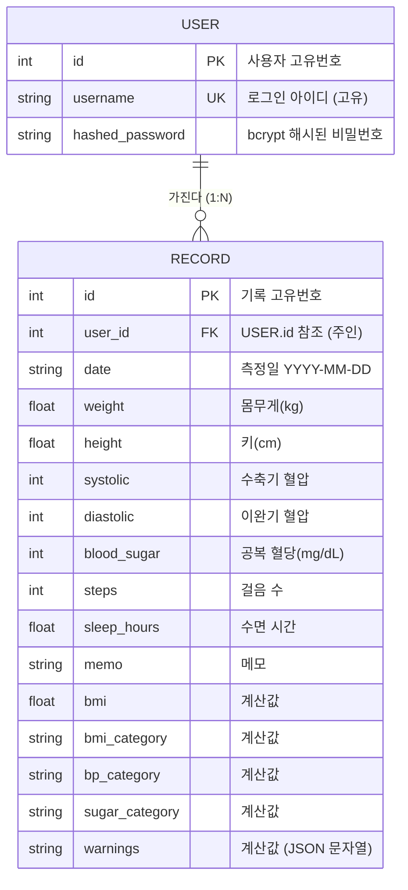

# 데이터 모델 (ERD) & 스키마 매핑

## 1. ERD

- **관계**: 사용자 1명(`USER`)이 여러 기록(`RECORD`)을 가진다 (1:N).
- **PK** = Primary Key(고유 식별자), **FK** = Foreign Key(다른 표 참조), **UK** = Unique(중복 불가).
- 실제 정의 위치: [`database.py`](../database.py)

## 2. USER 테이블

| 칼럼 | 타입 | 키 | 출처 | 설명 |
|------|------|----|------|------|
| id | Integer | PK | 자동 | 사용자 고유번호 (auto increment) |
| username | String | UK | API 입력 | 로그인 아이디, 중복 불가 |
| hashed_password | String | | 서버 처리 | 입력받은 평문 비번을 bcrypt로 해시해 저장 |

## 3. RECORD 테이블

| 칼럼 | 타입 | 키 | 출처 | 설명 |
|------|------|----|------|------|
| id | Integer | PK | 자동 | 기록 고유번호 |
| user_id | Integer | FK | 인증 토큰 | 로그인한 사용자의 id (토큰에서 추출) |
| date | String | | API 입력 | 측정일 |
| weight | Float | | API 입력 | 몸무게(kg) |
| height | Float | | API 입력 | 키(cm) |
| systolic | Integer | | API 입력 | 수축기 혈압 |
| diastolic | Integer | | API 입력 | 이완기 혈압 |
| blood_sugar | Integer | | API 입력 | 공복 혈당 |
| steps | Integer | | API 입력(기본 0) | 걸음 수 |
| sleep_hours | Float | | API 입력(기본 0.0) | 수면 시간 |
| memo | String | | API 입력(기본 "") | 메모 |
| bmi | Float | | 서버 계산 | weight / (height/100)² |
| bmi_category | String | | 서버 계산 | 저체중/정상/과체중/비만 |
| bp_category | String | | 서버 계산 | 정상/주의/고혈압 |
| sugar_category | String | | 서버 계산 | 정상/공복혈당장애/당뇨 의심 |
| warnings | Text | | 서버 계산 | 경고 목록 (JSON 문자열로 저장) |

## 4. DB ↔ API 스키마 매핑

DB 표(저장 구조)와 API 스키마(Pydantic, 요청/응답)는 **일부러 다르다**. 아래가 그 연결.

### 회원가입 — `UserCreate` → `USER`

| API 입력 (UserCreate) | → | DB 저장 (USER) |
|----------------------|----|----------------|
| username | → | username |
| password (평문) | → bcrypt 해시 → | hashed_password |
| — | | id (자동 생성) |

### 로그인 — `OAuth2PasswordRequestForm` → JWT

| API 입력 | 처리 | 응답 |
|---------|------|------|
| username, password | DB 해시와 대조(verify) | JWT access_token 발급 |

### 기록 추가 — `RecordIn` → `RECORD`

| API 입력 (RecordIn) | → | DB 저장 (RECORD) |
|--------------------|----|------------------|
| date, weight, height, systolic, diastolic, blood_sugar, steps, sleep_hours, memo | → 그대로 → | 동일 칼럼 |
| — (토큰에서) | → | user_id |
| — | → 서버 계산 → | bmi, bmi_category, bp_category, sugar_category, warnings |

**핵심**: API 입력에는 없는 `user_id`(인증)와 계산값(bmi 등)을 **서버가 채워서** DB에 저장한다. 그래서 DB 스키마와 API 스키마가 1:1이 아니다.

## 5. 관련 파일

| 파일 | 역할 |
|------|------|
| [`database.py`](../database.py) | DB 연결 + 표(User, Record) 정의 = ERD 구현체 |
| [`main.py`](../main.py) | API 스키마(Pydantic) + 엔드포인트 |
| [`auth.py`](../auth.py) | bcrypt 해시, JWT 토큰, 로그인 확인 |
