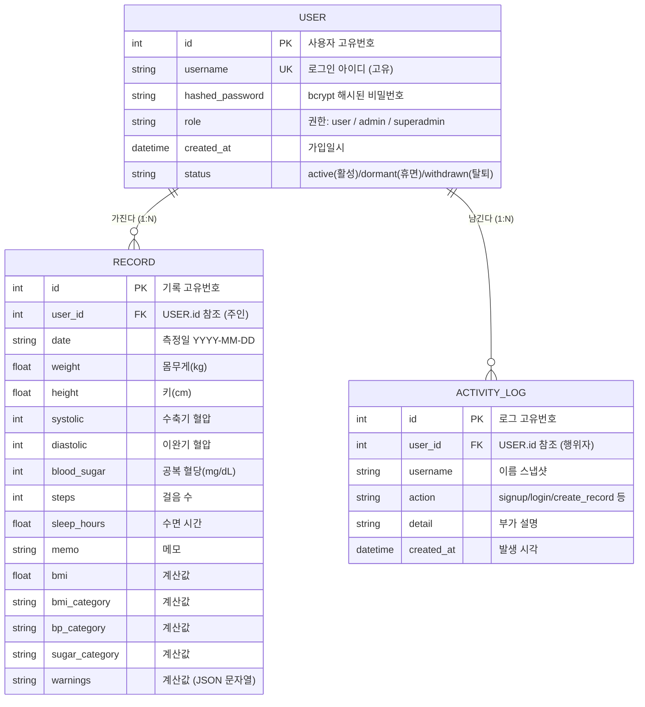

# 데이터 모델 (ERD) & 스키마 매핑

## 1. ERD

- **관계**: 사용자(`USER`) 1명이 여러 기록(`RECORD`)과 여러 활동 로그(`ACTIVITY_LOG`)를 가진다 (각각 1:N).
- **PK** = Primary Key, **FK** = Foreign Key, **UK** = Unique.
- 실제 정의 위치: [`database.py`](../database.py) · DDL: [`schema.sql`](schema.sql)

## 2. USER 테이블

| 칼럼 | 타입 | 키 | 출처 | 설명 |
|------|------|----|------|------|
| id | Integer | PK | 자동 | 사용자 고유번호 |
| username | String | UK | API 입력 | 로그인 아이디, 중복 불가 |
| hashed_password | String | | 서버 처리 | 평문 비번을 bcrypt로 해시해 저장 |
| role | String | | 서버 처리 | `user`/`admin`/`superadmin`. 기본 `user`, **첫 가입자는 `superadmin`** |
| created_at | DateTime | | 자동 | 가입일시 |

## 3. RECORD 테이블

| 칼럼 | 타입 | 키 | 출처 | 설명 |
|------|------|----|------|------|
| id | Integer | PK | 자동 | 기록 고유번호 |
| user_id | Integer | FK | 인증 토큰 | 로그인한 사용자 id (토큰에서 추출) |
| date | String | | API 입력 | 측정일 |
| weight / height | Float | | API 입력 | 몸무게 / 키 |
| systolic / diastolic | Integer | | API 입력 | 수축기 / 이완기 혈압 |
| blood_sugar | Integer | | API 입력 | 공복 혈당 |
| steps / sleep_hours / memo | Int/Float/String | | API 입력(기본값) | 선택 항목 |
| bmi | Float | | 서버 계산 | weight / (height/100)² |
| bmi_category | String | | 서버 계산 | 저체중/정상/과체중/비만 |
| bp_category | String | | 서버 계산 | 정상/주의/고혈압 |
| sugar_category | String | | 서버 계산 | 정상/공복혈당장애/당뇨 의심 |
| warnings | Text | | 서버 계산 | 경고 목록 (JSON 문자열) |

## 4. ACTIVITY_LOG 테이블

| 칼럼 | 타입 | 키 | 출처 | 설명 |
|------|------|----|------|------|
| id | Integer | PK | 자동 | 로그 고유번호 |
| user_id | Integer | FK | 서버 처리 | 행위자 (실패 로그인은 NULL 가능) |
| username | String | | 서버 처리 | 이름 스냅샷 |
| action | String | | 서버 처리 | signup/login/login_failed/create_record/update_record/delete_record |
| detail | String | | 서버 처리 | 부가 설명 |
| created_at | DateTime | | 자동 | 발생 시각 |

## 5. DB ↔ API 스키마 매핑

DB 표(저장 구조)와 API 스키마(Pydantic)는 **일부러 다르다**.

### 회원가입 — `UserCreate` → `USER`

| API 입력 (UserCreate) | → | DB 저장 (USER) |
|----------------------|----|----------------|
| username | → | username |
| password (평문) | → bcrypt 해시 → | hashed_password |
| — | → 첫 가입자면 superadmin → | role |

### 로그인 — `OAuth2PasswordRequestForm` → JWT

| API 입력 | 처리 | 결과 |
|---------|------|------|
| username, password | DB 해시와 대조 | JWT 토큰 발급 + ACTIVITY_LOG 기록 |

### 기록 추가 — `RecordIn` → `RECORD`

| API 입력 (RecordIn) | → | DB 저장 (RECORD) |
|--------------------|----|------------------|
| date, weight, height, systolic, diastolic, blood_sugar, steps, sleep_hours, memo | → 그대로 → | 동일 칼럼 |
| — (토큰에서) | → | user_id |
| — | → 서버 계산 → | bmi, bmi_category, bp_category, sugar_category, warnings |

**핵심**: API 입력에 없는 `user_id`(인증), 계산값(bmi 등), `role`(정책), 로그를 **서버가 채워서** DB에 저장한다. 그래서 DB 스키마와 API 스키마는 1:1이 아니다.

## 6. 권한 체계 (role)

3단계: `user` < `admin` < `superadmin`. 첫 가입자는 자동으로 `superadmin`.

| 역할 | 권한 |
|------|------|
| user | 본인 기록만 CRUD |
| admin | 관리자 대시보드 **조회** (사용자·로그·통계). 권한 변경 불가 |
| superadmin | 조회 + **권한 변경(승격/강등)**. 마지막 superadmin은 강등 불가 |

- 조회 창구: `GET /admin/users`, `GET /admin/logs`, `GET /admin/stats` (admin·superadmin, 그 외 403)
- 권한 변경: `PUT /admin/users/{id}/role` (superadmin 전용)
- `/dashboard` 페이지에서 관리자 대시보드 표시(차트·사용자표·활동피드). superadmin은 사용자 권한 변경 가능.

## 7. 관련 파일

| 파일 | 역할 |
|------|------|
| [`database.py`](../database.py) | 표(User, Record, ActivityLog) 정의 = ERD 구현체 |
| [`main.py`](../main.py) | API 스키마(Pydantic) + 엔드포인트 |
| [`auth.py`](../auth.py) | bcrypt 해시, JWT 토큰, 로그인/관리자 확인 |
| [`schema.sql`](schema.sql) | ErdCloud import용 DDL |
