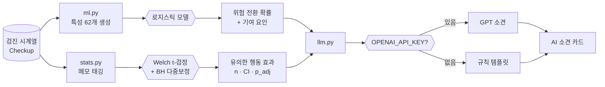
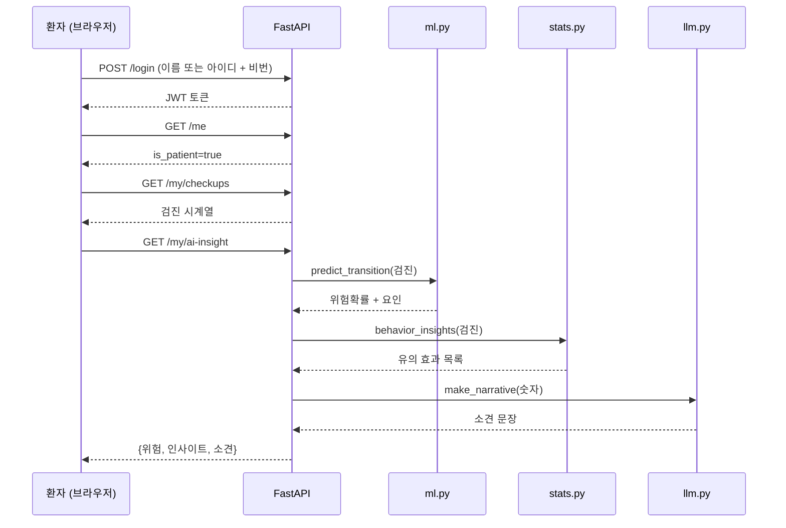

# 프로세스 플로우

## 1. 전체 데이터 파이프라인

```mermaid
flowchart TD
    subgraph 생성["① 데이터 생성 (오프라인)"]
        A[gen_cohort.py<br/>인구통계 기준 시계열 생성] --> B[(checkups.parquet<br/>10만명 · 180만 검진)]
    end

    subgraph 분석["② 분석 (Colab)"]
        B --> C[colab_eda_only.ipynb<br/>EDA · 특성 선택]
        C --> D[colab_ml_transition.ipynb<br/>모델 6종 비교]
    end

    subgraph 학습["③ 모델 학습 (로컬)"]
        B --> E[train_model.py<br/>로지스틱 학습]
        E --> F[(risk_model.joblib<br/>62특성 · PR-AUC 0.535)]
    end

    subgraph 적재["④ DB 적재 (로컬)"]
        B --> G[load_cohort.py<br/>5천명 샘플 + 이름 + 인과메모]
        G --> H[(health.db<br/>users · checkups · logs)]
    end

    subgraph 서빙["⑤ 서빙 (FastAPI)"]
        H --> I[main.py API]
        F --> I
        I --> J[/dashboard<br/>관리자]
        I --> K[/ui<br/>환자 개인]
    end
```

## 2. AI 인사이트 3단 파이프라인

회원 상세(관리자) 또는 개인 화면(환자)을 열 때 실행된다.



**역할 분담 (판단은 누가 하는가):**

| 단계 | 담당 | 하는 일 | 검증 |
|------|------|---------|------|
| 위험 확률 | **ML (로지스틱)** | 다음 분기 위험 전환 예측 | PR-AUC 0.535 (무작위의 5.5배) |
| 행동 효과 | **통계 (Welch t)** | 메모–지표 인과의 유의성 판정 | 95% CI + 다중비교 보정 |
| 서술 | **LLM** | 숫자를 문장으로 (판단 안 함) | 유의 효과만 언급, 없는 값 금지 |

## 3. 요청 흐름 (환자 로그인 예시)



## 4. RECORD vs CHECKUP

| | RECORD | CHECKUP |
|---|--------|---------|
| 출처 | 사용자가 앱에서 매일 입력 | 병원 검진 (분기 1회) |
| 주기 | 일 단위 | 분기 (3개월) |
| 지표 | 체중·혈압·혈당·메모 | 14개 검진 지표 + 종합판정 |
| 용도 | 과제 기본 기능 (CRUD) | ML 위험예측 · 통계 인사이트 |
| 현재 데이터 | 비어 있음 (코호트로 전환) | 5,000명 · 9만 건 |

> 스키마 상세: [`ERD.md`](ERD.md) · DDL: [`schema.sql`](schema.sql)
